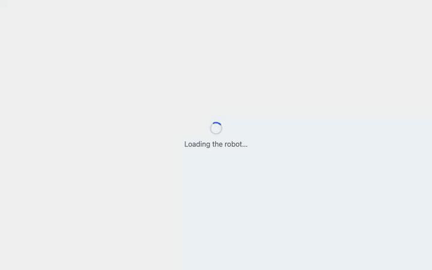
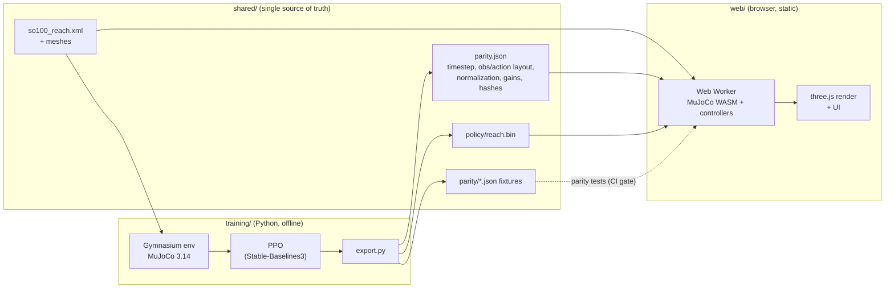

# sim2browser

**Train in simulation, run a verified copy in the browser.** A robot arm you can play with in
your browser. A policy learned with reinforcement learning
controls it live: drag the blue target and the arm reaches for it. Switch to a classical
controller at any moment and compare. No install and no server: MuJoCo physics, the neural
network and the rendering all run in your browser tab.

**Live demo: [rotvie.github.io/sim2browser](https://rotvie.github.io/sim2browser/)** (add `?lab` for the
example plug-in controller)



## What's interesting here

- **Real physics in the browser.** The official MuJoCo WebAssembly build simulates an SO-100 arm
  (from MuJoCo Menagerie) at 500 Hz in a Web Worker, so rendering stays smooth, including on phones.
- **Learned vs. engineered, side by side.** A PPO policy and a damped least-squares IK controller
  drive the same simulated arm under identical conditions. You can switch mid-motion without a
  reset.
- **Train in Python, run in the browser, and prove they match.** The policy is trained offline in
  Python MuJoCo. Parity tests replay the same actions on both engines and require them to agree:
  they match to about 1e-14 over 500-step trajectories, and the TypeScript network matches
  PyTorch to about 3e-7.
- **Plug in your own controller** in one file and one line, then evaluate it headlessly against
  the others ([below](#plug-in-your-own-controller)).
- **Honest numbers.** The in-app info panel shows measured results, including where the learned
  policy falls short.

## Results

Measured on the shipped code path (the TypeScript controllers on the WASM simulation), from the
neutral pose to random reachable targets. Success = tip within 1 cm, nearly still (< 2 cm/s) for
0.2 s, within 2 s.

| Controller                         | Success (100 targets) | Success (300 targets) | Median settle time | Tip jerk vs. baseline |
| ---------------------------------- | --------------------- | --------------------- | ------------------ | --------------------- |
| Baseline (damped least-squares IK) | 100%                  | 100%                  | 1.14 s             | 1.00                  |
| **Learned (PPO, 2×128 MLP)**       | **95%**               | **94.0%**             | 1.12 s             | **0.68–0.72**         |
| Jacobian transpose (lab example)   | 64%                   |                       | 1.56 s             | 1.86                  |

The learned policy moves about **30% more smoothly** (lower mean squared tip jerk) than the
classical reactive controller, at a similar speed, but is less precise: about 6% of targets stall
1–2 cm short. Details, including every training run, are in
[`specs/001-arm-reach/validation.md`](specs/001-arm-reach/validation.md).

**Caveats.** The comparison is between _reactive_ controllers; a classical controller that plans a
smooth trajectory (e.g. minimum-jerk) would also be smooth. The training recipe is not robust: of
three training seeds, two reach 92–94% and one never learns to settle (0%); the shipped policy is
the better of the two, chosen on a separate target set. The policy leaves the wrist-roll joint
alone, since rolling the wrist does not move the tip. The arm's workspace is the space in front
of its base.

## How it works



- **`shared/parity.json`** holds every value parity depends on (physics timestep, control rate,
  observation layout, action scale, normalization statistics, baseline gains) plus hashes of the
  model, workspace grid and policy. Only training writes it; the browser, the evaluation and the
  tests only read it, and refuse to run on a mismatch.
- **The browser** loads the WASM engine and the robot files in parallel, verifies their hashes,
  and steps the simulation in a worker at 50 Hz control / 500 Hz physics. The main thread renders
  and handles input. The page is interactive in about 2.9 s at 12 Mbit/s (2.4 MB brotli before
  interactive); the 80 KB policy loads only when Learned is first selected.
- **The policy** is an 18 → 128 → 128 → 4 MLP run in about 30 lines of plain TypeScript (no
  inference runtime). It sees the angles and speeds of the four joints that move the tip, the
  target, the tip-to-target vector and its previous command, and outputs joint-target changes.

## Plug in your own controller

Controllers read the simulation state and write joint-target changes. Create a file:

```ts
// web/src/control/myController.ts
import type { ControllerDef } from "./registry";

export const myController: ControllerDef = {
  id: "my-controller",
  label: "Mine",
  description: "One sentence for the info panel.",
  public: false, // shown with ?lab in the URL
  create({ sim, arm, parity, target }) {
    const maxPerStep = parity.baseline.maxJointSpeed / parity.controlHz; // shared speed limit
    return {
      enter() {}, // called when your controller is selected
      step() {
        // called at 50 Hz
        const tip = sim.sitePos(parity.tipSite); // world position (m)
        const J = sim.jacSiteJoints(parity.tipSite); // 3 × 5 Jacobian, row-major
        const t = target(); // where the visitor put the target
        const e = [t[0] - tip[0], t[1] - tip[1], t[2] - tip[2]];
        // Your control law here. This one is a naive Jacobian-transpose step: dq = k·Jᵀe.
        const n = sim.nu;
        const dq = new Float64Array(n);
        for (let j = 0; j < n; j++)
          dq[j] = 0.5 * (J[j] * e[0] + J[n + j] * e[1] + J[2 * n + j] * e[2]);
        arm.applyDelta(dq, maxPerStep); // clipped to speed and joint limits
      },
    };
  },
};
```

Add it to `CONTROLLERS` in [`web/src/control/registry.ts`](web/src/control/registry.ts), then:

```bash
cd web
npm run dev                                                  # open …/sim2browser/?lab
npm run eval -- --controller baseline --n 100 --seed 0       # reference
npm run eval -- --controller my-controller --n 100 --seed 0  # success, settle time, jerk
npm run eval:compare -- --controller my-controller           # vs. the baseline
```

[`jacobianTranspose.ts`](web/src/control/jacobianTranspose.ts) is a complete example (about 40
lines). Also available: `sim.q()`, `sim.qd()`, `sim.fkSite()`, `sim.limits`, the observation
layout in `parity.observation`, and `read()` for loading your own files from `shared/`.

## Run it locally

Requirements: Node 22+, Python 3.12 with [uv](https://docs.astral.sh/uv/).

```bash
npm install                      # web + test tooling (npm workspaces)
cd web && npm run dev            # http://localhost:5173/sim2browser/
```

Tests:

```bash
cd web && npm test               # unit (Vitest)
npm run test:parity              # from the repo root: Python ↔ WASM parity gate
cd web && npx playwright install chromium webkit && npm run test:e2e   # e2e (desktop + mobile)
cd training && uv sync && uv run pytest                                # training side
```

Reproduce the shipped policy (CPU, about 25 minutes per 30M steps on a 12-core laptop). It was
trained in two stages: 40M steps with the default reward (smoothness penalties ramped in over the
first half), then 30M more with a sharper 1 cm precision term:

```bash
cd training
uv run python -m reach.train --seed 0 --steps 40000000 --name stage1
uv run python -m reach.train --seed 1 --steps 30000000 --ramp 0 --resume stage1 \
  --w_precision 1.0 --w_precision_scale 0.01 --name stage2
uv run python -m reach.evaluate --run stage2          # quick training-side check
uv run python -m reach.export --run stage2            # writes shared/parity.json + policy
uv run python -m reach.make_fixtures --run stage2     # regenerates the parity fixtures
cd ../web && npm run eval -- --controller learned && npm run eval:compare
```

RL training varies from seed to seed, so expect numbers near, not equal to, the ones above.

## Repository layout

```text
shared/     robot model, parity.json, workspace grid, policy, parity fixtures
training/   Gymnasium env, PPO training, export, fixtures, evaluation (Python)
web/        the demo: sim worker, controllers (registry), rendering, UI, eval scripts (TypeScript)
tests/      cross-side parity tests
specs/      how it was built: constitution, spec, plan, tasks, validation log
```

The project was built spec-first ([Spec Kit](https://github.com/github/spec-kit)): the
[constitution](.specify/memory/constitution.md) sets the rules (browser-only, sim parity is
tested, every milestone ships, learned vs. engineered is always visible, minimal), and
[`specs/001-arm-reach/`](specs/001-arm-reach/) has the spec, plan, tasks and a validation log
that records measurements, failures and decisions.

## Where this could go

See [`docs/ROADMAP.md`](docs/ROADMAP.md) for status, open items and the plan toward manipulation.

- Recover from shoves: push the arm and watch each controller recover (next feature).
- Sensor noise, latency and dropout as live knobs, to see controllers degrade.
- More MuJoCo sensors (force/torque, touch) and more robots from Menagerie.
- A local bridge so a Python notebook can drive the browser simulation.

## Credits

- [MuJoCo](https://mujoco.org) and its WebAssembly bindings, Google DeepMind (Apache-2.0).
- SO-ARM100 model from [MuJoCo Menagerie](https://github.com/google-deepmind/mujoco_menagerie)
  (Apache-2.0); modifications listed in [`shared/robot/README.md`](shared/robot/README.md).
- [three.js](https://threejs.org) (MIT), [Stable-Baselines3](https://github.com/DLR-RM/stable-baselines3) (MIT),
  [Gymnasium](https://gymnasium.farama.org) (MIT).

## License

[MIT](LICENSE) for this project's code. The robot model and meshes in `shared/robot/` keep their
Apache-2.0 license ([`shared/robot/LICENSE`](shared/robot/LICENSE)).
